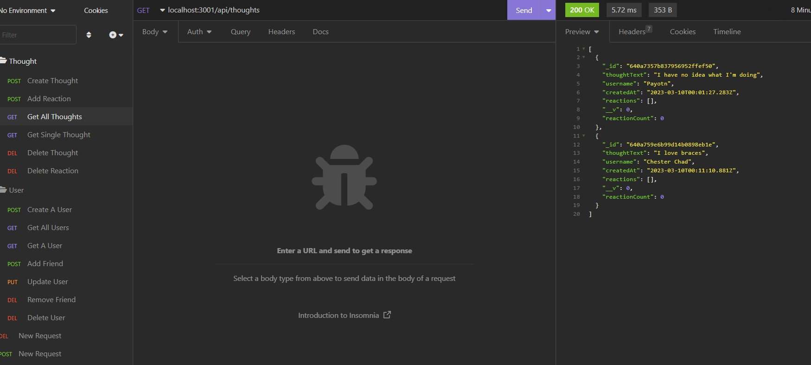

  # Social Networking API
  
  ## License
  
  ## Description
  The backend routing for a social networking app made with mongoose allowing the creation of users, ability to post, add reactions, add friends, and delete posts or users.
  
  ## Demo Video
  https://drive.google.com/file/d/1sE-eoW4FlnhruN15NU0HxT_sZoMsI2zS/view
  
  ## Table of Contents
  * [Installation](#installation)
  * [Usage](#usage)
  * [Screenshot](#screenshot)
  * [Contributions](#contributions)
  * [Test Instructions](#test-instructions)
  * [Contact](#contact)
  ## Installation
  https://github.com/Ikomeda/social-networking-api go here and git clone from the ssh key to download onto your computer so you can test out the functionality!
  ## Usage
  Make sure to run npm i or npm install and then node server.js, use a third party app like insomnia to go to the localhost:3001 to test out the different routes. You could even use mongodb compass!
  ## Screenshot
  
  ## Contributions
  n/a
  ## Test Instructions
  n/a
  ## Contact
  * GitHub: https://github.com/Ikomeda/
  * Email: n/a
